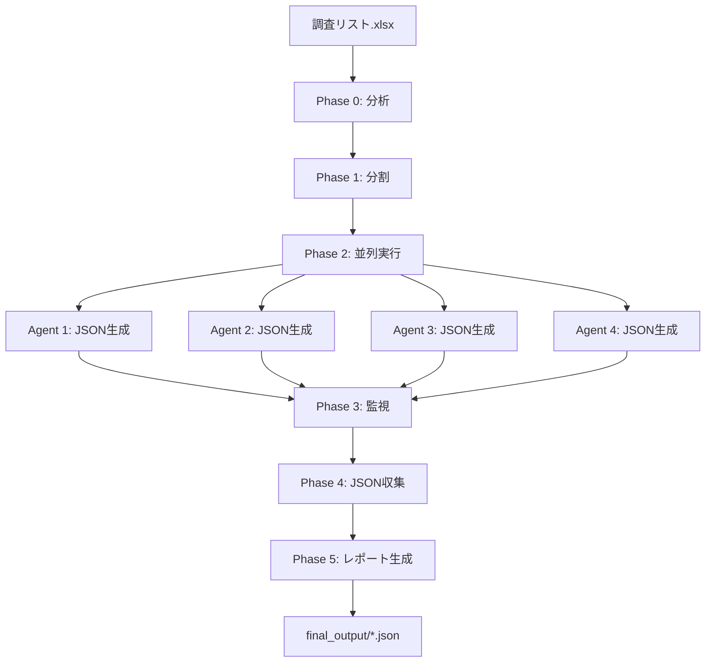

# Tech Longlist Orchestrator (JSON)

複数のtech-longlist-pipeline-jsonエージェントを並列制御し、大規模技術調査リストを高速処理するオーケストレーター。

## 🎯 主な機能

### 自動化された並列処理
- ✅ 調査リストExcelファイルの自動分割
- ✅ 最適エージェント数の自動判定
- ✅ 複数エージェントの並列起動と監視
- ✅ JSON形式での個別ファイル出力
- ✅ 結果の自動収集と品質検証
- ✅ 統合レポート生成

### パフォーマンス向上
- **70%の処理時間削減** (4エージェント並列時)
- **スケーラブル**: 最大8エージェント対応
- **エラー耐性**: 個別エージェント失敗時も他は継続

## 📋 使い方

### 基本的な使用方法

Claude Codeで以下のように依頼するだけ:

```
調査リスト.xlsxをオーケストレーターで調査して
```

### 自動実行される処理

1. **データ分割** - 調査リストを最適な数に自動分割
2. **並列実行** - 複数のtech-longlist-pipeline-jsonエージェントを起動
3. **進捗監視** - 各エージェントの実行状態を追跡（JSONファイル生成数でカウント）
4. **結果収集** - 完了後、全JSONファイルを`final_output/`ディレクトリに整理
5. **レポート生成** - 統合レポートと統計情報を作成

## 📦 必要な環境

### Python パッケージ
```bash
pip install pandas openpyxl
```

### システム要件
- **メモリ**: 4GB以上推奨
- **ディスク**: 500MB以上の空き容量
- **Python**: 3.8以上

## 📊 処理時間の目安

| 調査対象数 | 単一エージェント | 4並列 | 削減率 |
|-----------|----------------|-------|--------|
| 12件 | 約15分 | 約5分 | 66% |
| 50件 | 約60分 | 約18分 | 70% |
| 100件 | 約120分 | 約35分 | 71% |

## 🗂️ ファイル構成

```
tech-longlist-orchestrator-json/
├── SKILL.md                    # エージェント定義
├── README.md                   # このファイル
└── scripts/
    ├── split_excel.py         # Excel分割スクリプト
    └── collect_results.py     # JSON収集スクリプト
```

## 🔧 スクリプト詳細

### split_excel.py - データ分割

**機能**:
- Excelファイルを複数に均等分割
- メタデータ生成と検証
- エージェント別ID範囲管理

**使用例**:
```bash
python split_excel.py 調査リスト.xlsx 4
```

### collect_results.py - JSON収集

**機能**:
- 各エージェントの検証済みJSONファイルを収集
- `final_output/`ディレクトリへの整理とコピー
- 重複IDチェック
- 検証スコアと組織名の表示

**使用例**:
```bash
python collect_results.py work_dir/output work_dir/final_output
```

## 📈 最適エージェント数

| 調査対象数 | 推奨エージェント数 |
|-----------|-----------------|
| 1-11件 | 1 (オーケストレーション不要) |
| 12-24件 | 2 |
| 25-49件 | 3 |
| 50-99件 | 4 |
| 100-199件 | 5-6 |
| 200件以上 | 6-8 |

## ⚠️ 注意事項

### 推奨ケース
- ✅ 調査対象が50件以上
- ✅ 処理時間を短縮したい
- ✅ システムリソースに余裕がある

### 推奨しないケース
- ❌ 調査対象が12件未満（効果が薄い）
- ❌ メモリが4GB未満
- ❌ ネットワーク帯域が狭い

## 🐛 トラブルシューティング

### エージェントが起動しない
- システムリソースを確認
- エージェント数を減らして再試行

### JSON収集時にエラーが発生
- 各エージェントの出力ファイルを確認
- `work_dir/output/agent_*/` 配下のJSONファイルを確認
- 検証済みファイル（`*_verified.json`）が生成されているか確認

### 重複IDが検出される
- 統合レポートで詳細確認
- 元データの重複をチェック
- 各エージェントのID範囲が重複していないか確認

## 🔄 ワークフロー詳細



## 📝 出力ファイル

### 最終成果物
- `work_dir/final_output/` - 全エージェントの検証済みJSONファイルを格納
  - `001_Company_Name_verified.json`
  - `002_Company_Name_verified.json`
  - ...
  - `100_Company_Name_verified.json`
- `統合レポート.md` - 統合統計とサマリー

### 中間ファイル
- `work_dir/input/調査リスト_エージェントN.xlsx` - 分割データ
- `work_dir/output/agent_N/` - エージェント別JSON出力
  - `001_Company_Name.json` - 初期生成
  - `001_Company_Name_verified.json` - 検証済み
  - `verification_report_*.md` - 検証レポート

## 🚀 今後の拡張

- [ ] 動的スケーリング（システムリソースに応じた自動調整）
- [ ] リアルタイム進捗ダッシュボード
- [ ] 失敗時の自動リトライ
- [ ] クラウド実行対応（AWS Lambda等）

## 📄 ライセンス

このスキルは個人使用目的で作成されています。

## 📞 サポート

問題が発生した場合:
1. `work_dir/logs/` のログファイルを確認
2. エラーメッセージをClaude Codeに報告
3. システムリソース（メモリ、CPU）を確認

---

**Version**: 1.0.0
**Last Updated**: 2025-01-06
**Author**: Claude Code SuperClaude Framework
